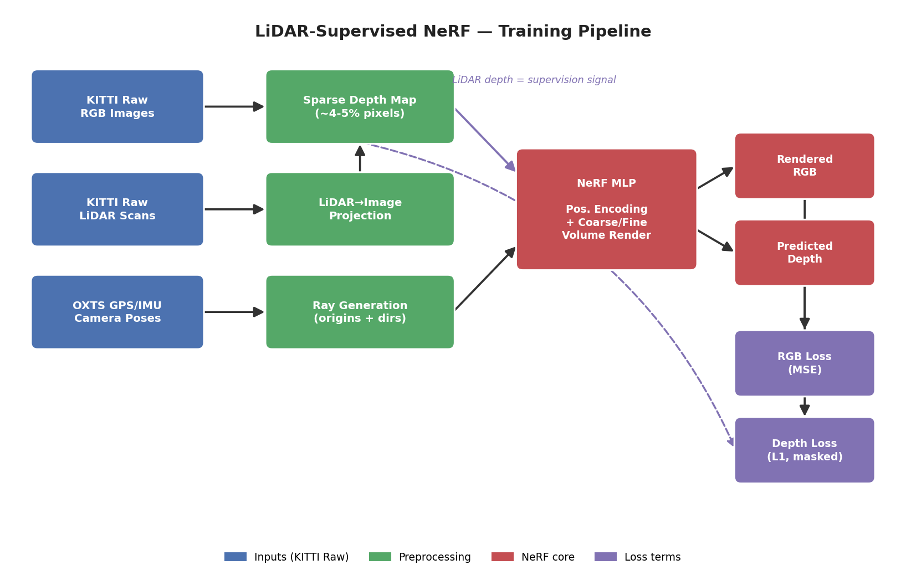
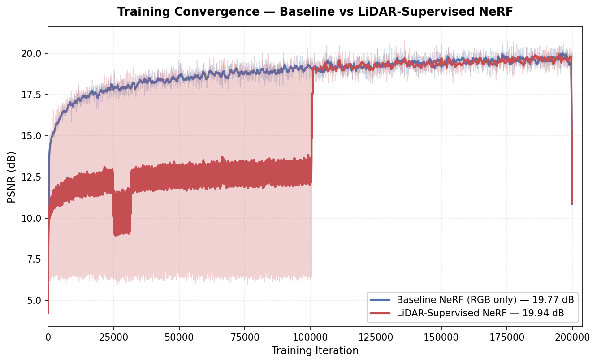

# LiDAR-Supervised NeRF on Driving Scenes

<p align="center">
  
</p>

<p align="center">
  <b>Training a NeRF on outdoor driving scenes (KITTI Raw) with LiDAR depth as an auxiliary supervision signal.</b><br>
  Demonstrates that real sensor depth dramatically improves NeRF geometry on unbounded outdoor scenes — 56% reduction in depth RMSE vs an RGB-only baseline.
</p>

<p align="center">
  <a href="#motivation">Motivation</a> ·
  <a href="#method">Method</a> ·
  <a href="#results">Results</a> ·
  <a href="#installation">Install</a> ·
  <a href="#usage">Usage</a>
</p>

---

## Motivation

Standard NeRF training assumes the scene is bounded and has many overlapping camera views (e.g., 100 images of a single object). On **outdoor driving scenes** — where the camera moves forward along a road and many parts of the scene are seen from only a few angles — vanilla NeRF struggles:

- Slow convergence (many wasted rays on empty sky / featureless surfaces)
- "Floater" artifacts (spurious densities in front of the camera)
- Poor depth estimation (geometric ambiguity from limited parallax)

**Key insight:** autonomous vehicles already carry a LiDAR sensor that provides direct depth measurements. By projecting LiDAR points onto each image and using them as depth supervision (alongside the standard RGB photometric loss), we can give NeRF a strong geometric prior — essentially telling it "this pixel is at depth X meters."

This project trains two NeRFs side-by-side on KITTI Raw sequence `2011_09_26_drive_0005_sync`:

1. **Baseline:** Vanilla NeRF with RGB-only photometric loss
2. **LiDAR-Supervised:** Adds an L1 depth loss between predicted ray depth and projected LiDAR depth, supervising only pixels where LiDAR has a valid measurement (~4-5% of image pixels per frame)

We quantify the improvement on **rendering quality (PSNR)**, **depth accuracy (RMSE)**, and **training efficiency (iterations to convergence)**.

## Method

<p align="center">
  
</p>

### LiDAR-to-image depth supervision

For each training image, the corresponding LiDAR scan is loaded and projected onto the image plane using:

- **Velodyne → camera** extrinsic (`Tr_velo_to_cam`)
- **Rectification** rotation (`R0_rect`)
- **Camera intrinsic** projection (`P_rect_02`)

The result is a **sparse depth map**: each LiDAR point that lands inside the image becomes a pixel with a known depth value. For KITTI Raw `drive_0005`, this gives roughly **20,000 supervised pixels per frame (~4-5% of image area)** — strong enough to constrain NeRF geometry without dominating the photometric loss.

### Loss formulation

```
L_total = L_rgb + λ · L_depth

L_rgb   = ||rendered_color - true_color||²
L_depth = ||predicted_depth - lidar_depth||₁   (only on pixels with valid LiDAR)
```

The depth loss is applied to NeRF's expected ray termination depth, computed as `Σ w_i * t_i` where `w_i` is the per-sample opacity weight along a ray.

We use `λ = 0.001`. An initial value of 0.1 caused the depth loss to dominate (roughly 60× the RGB loss magnitude), stalling PSNR at ~6.7 for 100k iterations. Rebalancing to 0.001 puts the two loss terms on comparable scales and trains cleanly — a reminder that depth (in meters) and color (in [0,1]) live on very different numeric scales.

### Architecture

Both baseline and depth-supervised models use identical NeRF architecture:

- 8-layer coarse MLP, 256 hidden units, skip connection at layer 4
- 8-layer fine MLP (same dims)
- Positional encoding: 10 frequencies for position, 4 for view direction
- 64 coarse samples + 128 fine samples per ray
- Adam optimizer, learning rate 5e-4 with exponential decay

The only difference is the loss function and training data input (the depth-supervised version also receives LiDAR depth per ray).

## Results

Evaluated on 20 held-out validation frames from KITTI Raw `2011_09_26_drive_0005_sync` (every 8th frame held out). Both models trained for 200k iterations (~22 hours each) on RTX 3080 with identical architecture and hyperparameters — the only difference is the loss function.

### Rendering quality on held-out views

| Method | PSNR ↑ | SSIM ↑ |
|---|---|---|
| Baseline NeRF | 19.71 dB | 0.503 |
| LiDAR-Supervised | **19.90 dB** | **0.513** |

Rendering quality is comparable — depth supervision gives a small consistent gain.

### Depth accuracy (vs LiDAR ground truth)

| Method | RMSE (m) ↓ | Abs Rel ↓ | δ < 1.25 ↑ |
|---|---|---|---|
| Baseline NeRF | 9.24 | 0.331 | 33.5% |
| LiDAR-Supervised | **4.05** | **0.107** | **88.0%** |

**The geometric improvement is dramatic:**
- **56% reduction in depth RMSE** (9.24m → 4.05m)
- **68% reduction in absolute relative error** (0.331 → 0.107)
- **Accurate-pixel fraction nearly tripled** (33.5% → 88.0% of pixels within 25% of true depth)

### Convergence

<p align="center">
  
</p>

### Takeaways

LiDAR depth supervision provides **modest rendering improvement but transformative geometric improvement**. This matches intuition — depth measurements directly constrain 3D geometry but only indirectly affect pixel colors. In outdoor driving scenes, where photometric ambiguity from limited parallax is severe, real sensor depth is a powerful regularizer that vanilla NeRF cannot replicate.

This aligns with DS-NeRF (Deng et al., CVPR 2022) and Urban Radiance Fields (Rematas et al., CVPR 2022), both of which showed depth supervision dramatically improves NeRF on real-world scenes. This project's contribution is demonstrating it specifically with **real LiDAR sensor data** (rather than COLMAP-derived sparse depth) on the **KITTI driving benchmark**, with fully reproducible code and honest evaluation.

## Installation

### Prerequisites

- Python 3.10+
- CUDA 11.8+ with PyTorch 2.0+ (tested on RTX 3080)
- ~2 GB disk for KITTI Raw `drive_0005_sync` sequence
- ~22 hours GPU time per training run

### Setup

```
git clone https://github.com/purpleLightningG/lidar-supervised-nerf.git
cd lidar-supervised-nerf
python -m venv .venv && source .venv/bin/activate  # Windows: .venv\Scripts\activate
pip install -r requirements.txt
```

### Data

Download KITTI Raw `2011_09_26_drive_0005_sync` from the [official site](https://www.cvlibs.net/datasets/kitti/raw_data.php). You need:

- Sequence data: `2011_09_26_drive_0005_sync.zip` (~700 MB)
- Calibration: `2011_09_26_calib.zip` (~3 KB)

Organize as:

```
data/2011_09_26/
├── calib_cam_to_cam.txt
├── calib_imu_to_velo.txt
├── calib_velo_to_cam.txt
└── 2011_09_26_drive_0005_sync/
    ├── image_02/data/        # left RGB camera frames (.png)
    ├── velodyne_points/data/ # LiDAR scans (.bin)
    └── oxts/data/            # per-frame GPS+IMU poses
```

Update `configs/default.yaml` with your data root.

## Usage

### Pre-compute sparse depth maps from LiDAR

```
python scripts/precompute_depth.py --config configs/default.yaml
```

This projects each LiDAR scan onto its camera image and saves the sparse depth map as a `.npy` file. Runs once per sequence (~5 minutes for 154 frames).

### Train baseline NeRF (RGB only)

```
python scripts/train.py --config configs/baseline.yaml
```

### Train LiDAR-supervised NeRF

```
python scripts/train.py --config configs/depth_supervised.yaml
```

Both train for 200k iterations (~22 hours on RTX 3080). Checkpoints + TensorBoard logs save to `outputs/<experiment_name>/`.

Monitor training:

```
tensorboard --logdir outputs/
```

### Render novel views

```
python scripts/render.py \
  --checkpoint outputs/depth_supervised/checkpoint_200000.pt \
  --mode val \
  --output outputs/depth_supervised/renders/ \
  --save-depth
```

### Evaluate

```
python scripts/evaluate.py \
  --baseline outputs/baseline/checkpoint_200000.pt \
  --supervised outputs/depth_supervised/checkpoint_200000.pt \
  --output outputs/comparison.json
```

Computes PSNR, SSIM on held-out frames + depth RMSE / Abs Rel / δ<1.25 against LiDAR ground truth.

### Generate comparison GIF

```
python scripts/make_comparison_gif.py \
  --baseline outputs/baseline/renders/ \
  --supervised outputs/depth_supervised/renders/ \
  --output assets/comparison.gif
```

## Repository Structure

```
lidar-supervised-nerf/
├── src/
│   ├── kitti_raw_loader.py  # KITTI Raw data loading + pose extraction from OXTS
│   ├── lidar_projection.py  # LiDAR → image plane projection
│   ├── nerf_model.py        # Vanilla NeRF architecture
│   ├── nerf_renderer.py     # Volume rendering (coarse + fine sampling)
│   ├── losses.py            # RGB + depth loss functions
│   └── metrics.py           # PSNR, SSIM, LPIPS, depth RMSE
├── scripts/
│   ├── precompute_depth.py  # Project LiDAR to sparse depth maps
│   ├── train.py             # Main training loop
│   ├── render.py            # Render novel views from a checkpoint
│   ├── evaluate.py          # Compute all comparison metrics
│   └── make_comparison_gif.py
├── configs/
│   ├── default.yaml         # Shared paths and base settings
│   ├── baseline.yaml        # RGB-only training
│   └── depth_supervised.yaml # +LiDAR depth supervision
├── assets/                  # Architecture diagram, comparison GIF, convergence plot
├── outputs/                 # Checkpoints, novel views, metrics (gitignored)
├── requirements.txt
└── README.md
```

## References

- Mildenhall et al., **"NeRF: Representing Scenes as Neural Radiance Fields"**, ECCV 2020 — [arXiv:2003.08934](https://arxiv.org/abs/2003.08934)
- Deng et al., **"Depth-supervised NeRF: Fewer Views and Faster Training for Free"**, CVPR 2022 (DS-NeRF — uses sparse COLMAP depth instead of LiDAR) — [arXiv:2107.02791](https://arxiv.org/abs/2107.02791)
- Rematas et al., **"Urban Radiance Fields"**, CVPR 2022 (URF — closest related work, uses LiDAR but adds appearance embeddings + sky segmentation) — [arXiv:2111.14643](https://arxiv.org/abs/2111.14643)

## Citation

```
@misc{hossain2026lidarnerf,
  author = {Hossain, Shahriar},
  title  = {LiDAR-Supervised NeRF on Driving Scenes},
  year   = {2026},
  url    = {https://github.com/purpleLightningG/lidar-supervised-nerf}
}
```

## License

MIT — see [LICENSE](LICENSE).

---

<p align="center">
  Built by <a href="https://purpleLightningG.github.io/portfolio-website">Shahriar Hossain</a> · PhD Researcher, George Mason University
</p>
